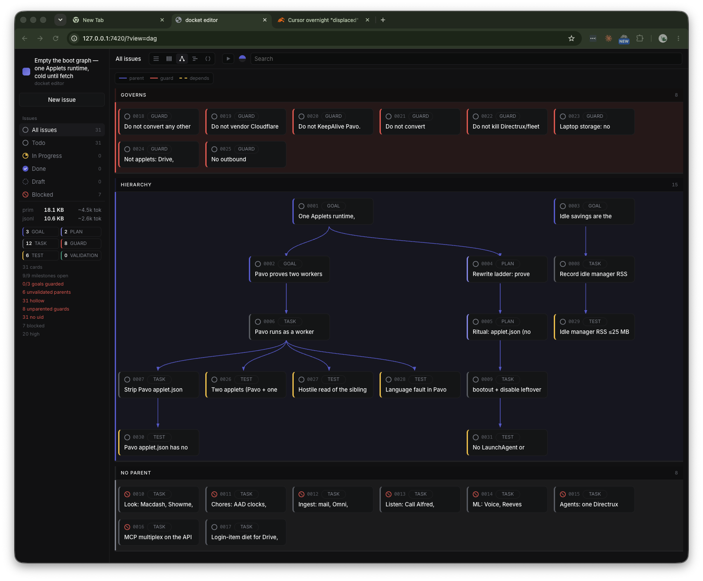
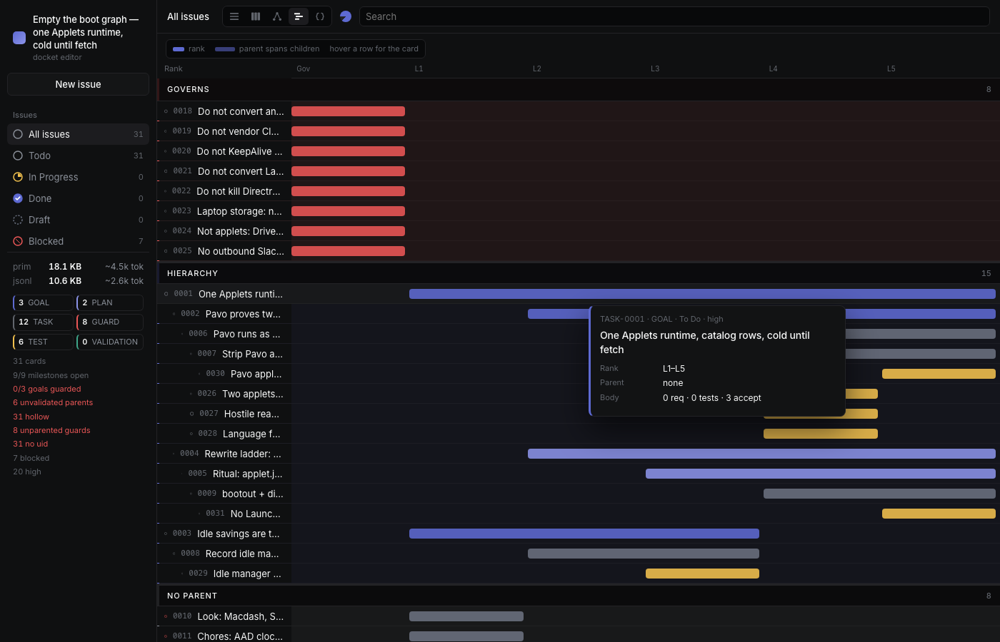
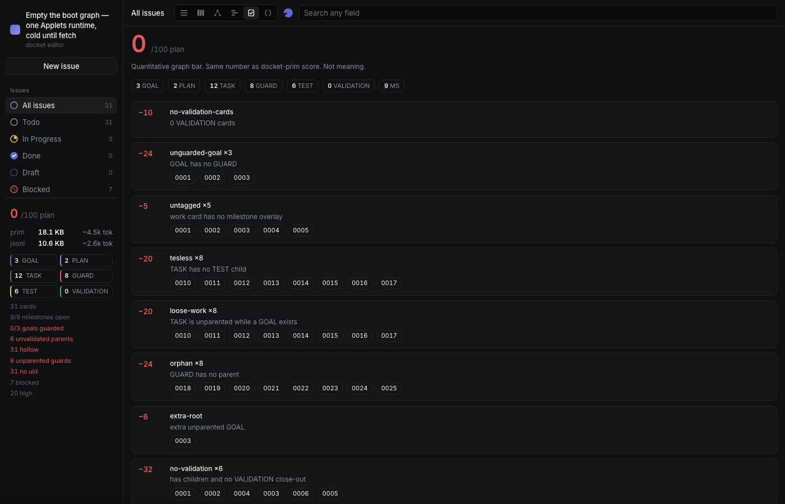
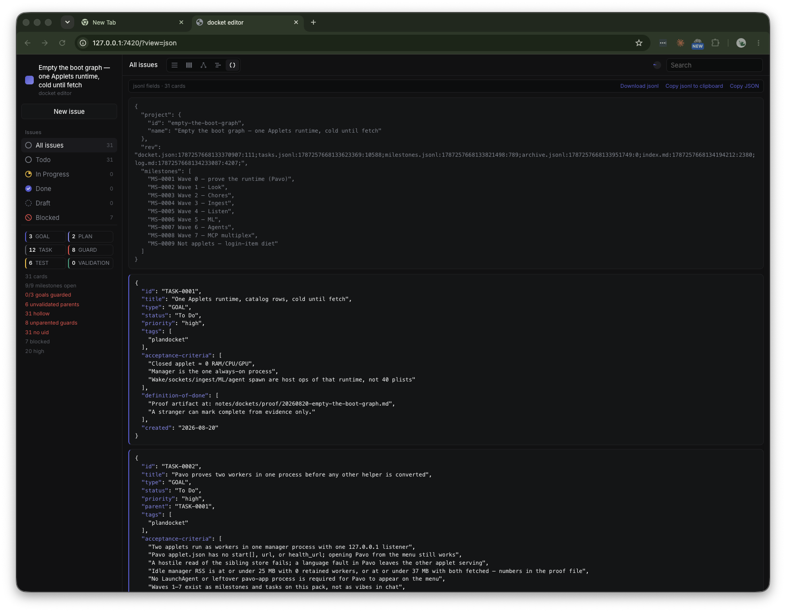

# docket-prim

A local board for a work pack. One directory on disk. Cards in `tasks.jsonl`. A page at `127.0.0.1`.

You schedule work, dispatch it, and close it. Same job as [docket.md](https://github.com/eidos-agi/docket.md). The markdown product keeps one `.md` file per task. This product keeps one pack both people and agents open.

Open the editor. Search any field. Watch the tree, the timeline, and the score. When the plan is misshapen, `docket-prim lift` writes the missing close-outs and tests.



The map has three bands. Refuses sit in **Governs**. The parent tree sits in **Hierarchy**. Unlinked work sits at the bottom so it cannot hide in the graph.



Gantt is rank, not calendar dates. Parent bars span their children. Hover a row for title, parent, notes, and the test list.



**Plan QA** is a 0–100 number for whether this is even a plan. Same figure as `docket-prim score`. Missing tests, orphan guards, parents with no close-out: those deduct. Empty notes do not; that is `validate`. `lift --dry-run` prints the patch list and the score after, and does not touch jsonl.



JSON is the sheet a builder actually reads. Copy jsonl (one record per line) or download `{project-id}.jsonl`.

```bash
go install github.com/eidos-agi/prim.docket/cmd/docket-prim@latest
# or from this clone:
go install ./cmd/docket-prim
```

```bash
docket-prim editor --dir /path/to/docket.prim
docket-prim convert --from /path/to/project          # .docket/ → docket.prim
docket-prim init --name Cerebro
docket-prim planner --dir ./notes/dockets/slice --name "outcome" --goal "outcome" \
  --done "proofable thing" --proof notes/goals/proof/x.md --json
docket-prim task-create --title "Ship login" --priority high
docket-prim task-list
docket-prim task-edit TASK-0001 --status "In Progress"
docket-prim task-complete TASK-0001
docket-prim score --json
docket-prim lift --dry-run --json
docket-prim info --json
```

`--dir` walks up to the pack. `--json` for agents.

The pack is the file. A cheap model can run one node. An expensive model closes a subtree (`VALIDATION`). Read [INTENTION.md](./INTENTION.md) and [SPEC.md](./SPEC.md). Category: [prim](https://github.com/eidos-agi/prim). Prim is not OKF.
